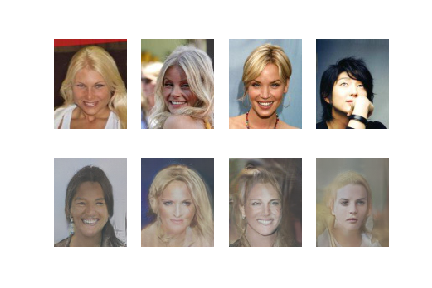

# GAN CelebA
GAN to generate new faces using Keras

## Features
* Generate faces with arbitrary qualities

* Faces in bottom half are generated with same qualities as real faces in top half

## Requirements
* Tensorflow 1.x
* Keras 2.x
* Numpy

## Run
1. Clone repository
2. Download CelebA dataset (I downloaded from [Kaggle](https://www.kaggle.com/jessicali9530/celeba-dataset))
3. Resize images if needed and move to img_mod
4. Open celeba.ipynb and run
